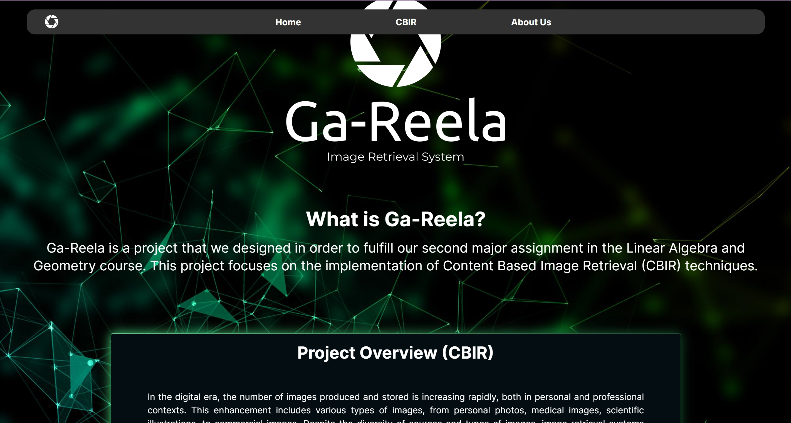
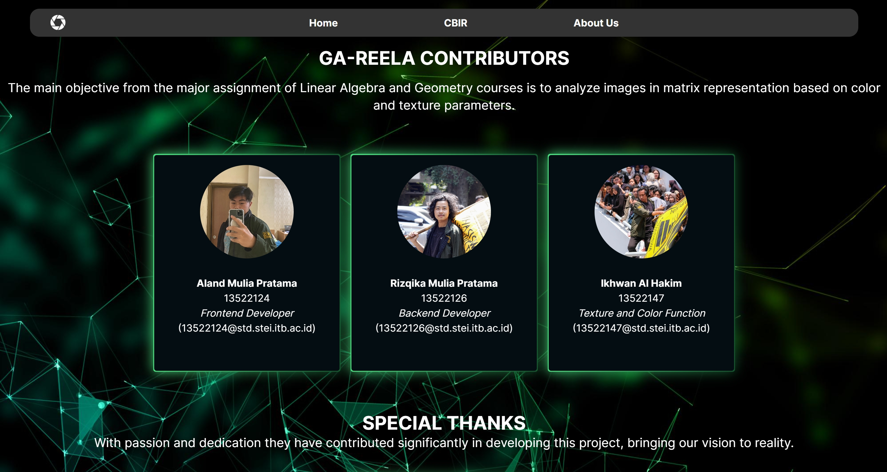
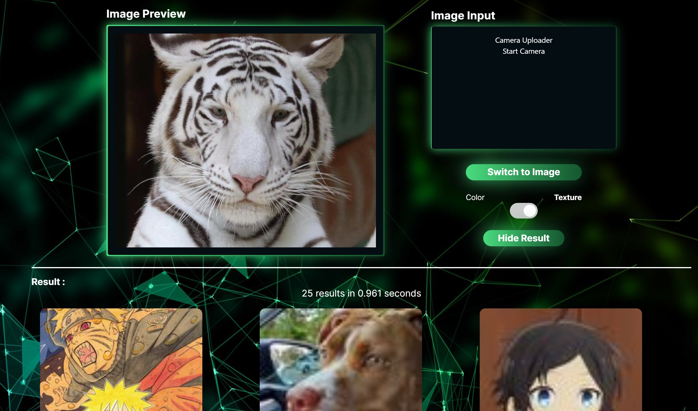

<div align="center">
  
</div>

# 📸 Ga-Reela: Image Retrieval System Program

> 🌐 Image Retrieval using cosine similarity

🎓 **Project Background:**
I created the CBIR website named "Ga-Reela" as part of my Linear Algebra and Geometry assignment during my third semester in the Computer Science program at ITB.

## 📝 Description
Content-Based Image Retrieval (CBIR) is a process for searching and retrieving images based on their visual content. This project, developed for the Linear Algebra and Geometry course assignment, starts by extracting essential features from images, such as color, texture, and shape. These features are then represented as vectors or numerical descriptors for comparison with other images. CBIR uses matching algorithms to compare feature vectors, enabling image retrieval within a dataset.

## 📁 Project Structure
```bash
Algeo02-22124
├── back-end
│   ├── app
│   │   └── api.py
│   ├── feature
│   │   ├── color_descriptor.py
│   │   ├── color_runner.py
│   │   ├── color_searcher.py
│   │   ├── database_init.py
│   │   ├── texture_descriptor.py
│   │   ├── texture_runner.py
│   │   └── texture_searcher.py
│   └── main.py
├── src (front-end)
│   ├── assets, components, conf, database, fonts, uploads
│   └── img (aboutus-preview.jpg, cbir-preview.jpg, home-preview.jpg)
├── App.js, index.css, index.js, logo.svg, reportWebVitals, setupTests.js
```

## Configuration Guide

### Front-End Setup:
1. Clone the repository to your local files. Access the repository [here](repository-link).
2. Open the terminal and ensure that the directory is set to `Ga-Reela-Content-Based-Image-Retrieval`.
3. Run `npm install` to activate the React-JS framework locally.
4. Execute `npm install react-router-dom` to enable routing to different paths.

### Back-End Configuration:
1. Run `pip install opencv-python` for image processing library activation.
2. Run `pip install numpy` for mathematical calculations in Python.
3. Run `pip install joblib` to facilitate parallel processing.
4. Run `npm install -g concurrently` to run both frontend and backend on the same localhost.
5. Run 'npm install axios' to handle sending and receiving responses.

## How to Run

1. Change the terminal directory to `Ga-Reela-Content-Based-Image-Retrieval`.
2. Execute `npm start`.
3. Navigate to the CBIR page via the website's `Navigation Bar` and upload the dataset using the `upload dataset` button.
4. Alternatively, use a website to access the dataset with the `switch to image scraper` button.
5. Select an image for searching within the dataset by clicking the `upload image` button.
6. Choose the real-time camera input option by pressing the `switch to camera` button.

## Screenshots

<div align="center">
  
  <p><i>Home Page</i></p>
</div>

<div align="center">
  
  <p><i>About Us Page</i></p>
</div>

<div align="center">
  
  <p><i>CBIR Page</i></p>
</div>